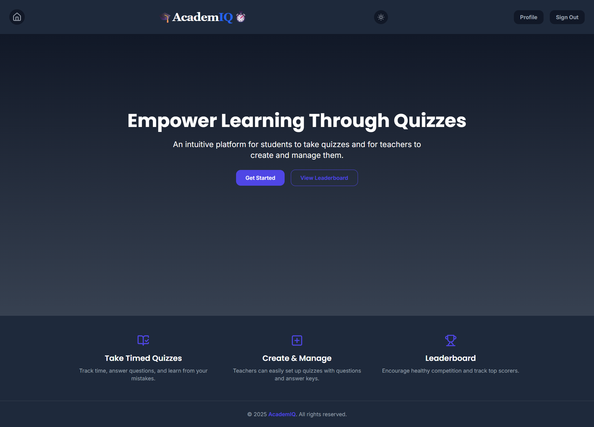
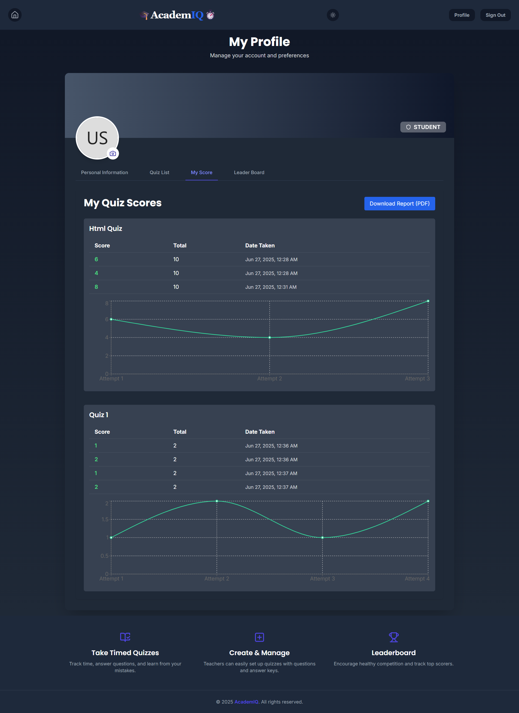
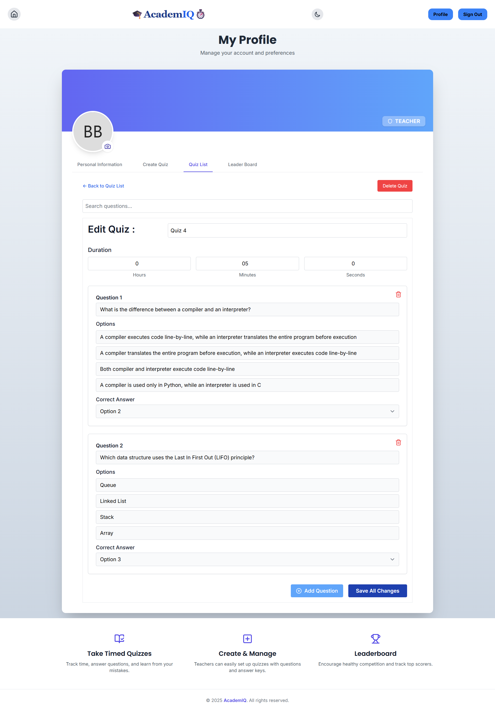

### Developer: Tharushika Rukshani

# 🎓AcademIQ⏱️

A full-featured role-based quiz management web application designed for both **teachers** and **students**. Teachers can create and manage quizzes, while students can take quizzes with real-time timer support, view their results instantly, and analyze their performance using graphs and tables.

---

## 🚀 Features

### 🧑‍🏫 Teacher Role
- Create, update, view, and delete quizzes
- Add, update, and delete questions for each quiz
- View quiz submissions by students
- Analyze student performance with per-question breakdown
- View global leaderboard across all students and quizzes

### 🧑‍🎓 Student Role
- Take quizzes with timer support (auto-submit on timeout)
- Instant result view with correct vs. wrong answers
- Reattempt previously completed quizzes
- View quiz history in tabular format
- Analyze scores using line graphs
- Download all attempts and results as a **PDF report**
- View global leaderboard with all student scores

---

## 📊 Dashboard & Analytics

- 📈 Line chart showing score trends over multiple attempts
- 📋 Table view of all quiz attempts with time and score breakdown
- 🏆 Leaderboard showing rankings based on total performance
- 📄 PDF export of quiz performance

---

## 🧩 Tech Stack

### Frontend
- **React** (with Vite)
- **Tailwind CSS** for UI styling
- **React Router** for routing
- **Chart.js** or **Recharts** for graphs
- **React Context** for authentication and role-based access
- **React Leaflet** for optional map-based features (if any)
- **React PDF** for PDF generation

### Backend (Microservices Architecture)
- **Node.js + Express**
- **MongoDB** with Mongoose
- **JWT** for secure authentication
- **Role-based Authorization Middleware**
- **Separate services** for user, quiz, and score management

---

## 🔐 Authentication & Roles

- Login/Register system using JWT
- Authenticated user stored in localStorage
- Role-based UI rendering:
  - Teachers see quiz management panel
  - Students see quiz-taking and history dashboards

------------------------------------------------------------------------

## ⚙️ Installation

### Prerequisites
- Node.js & npm
- MongoDB running locally or Atlas
- Docker for containerization

### Server
cd server
npm install
npm run dev

### Client
cd frontend
npm install
npm run dev

---------------------------------------------------------

## Screenshots

## Dark Mode Screenshots

# HomePage

# LeaderBoard

# Quiz List

## Teacher Dashboard

# Profile

# Create Quiz

# Edit and Delete Quiz and questions

## Teacher Dashboard

# Profile

# Start Quiz

# Questions

# Result

# Mistake Review

# Score History with graph comparison and Generate Report

## Light Mode Screenshots

# HomePage

# LeaderBoard

# Quiz List

## Teacher Dashboard

# Profile

# Create Quiz

# Edit and Delete Quiz and questions

## Teacher Dashboard

# Profile

# Start Quiz

# Questions

# Result

# Mistake Review

# Score History with graph comparison and Generate Report
